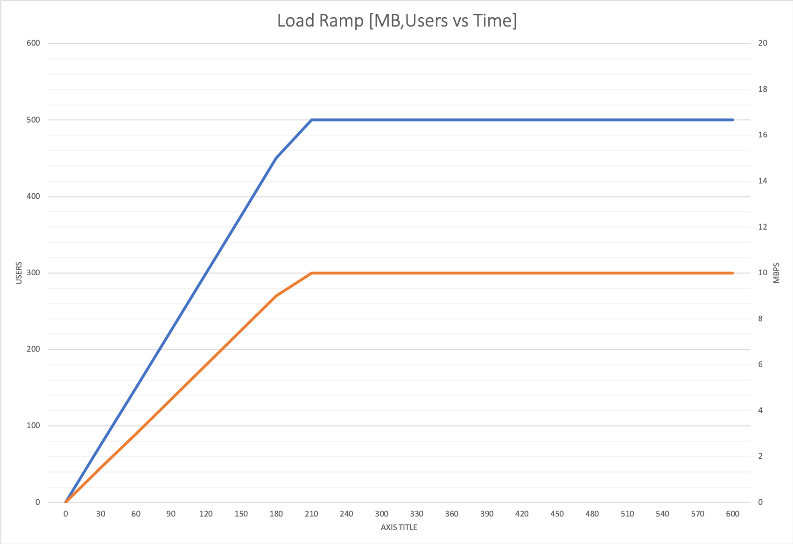

# Introduction
Congratulations! You have been selected for the next phase of the selection process: The assignment.

This phase consists of the making of a small software project. The true objective of this task is to have an opportunity for a discussion about your technical skills as well as your approach to the solution of software engineering problems.

There are three options. You should pick one only. Regardless what is your assignment you should follow the same criteria always:

## 1-Write the Requirements
You are in charge and you formulate the specific requirements. Use Functional (FR) and Not Functional Requirements (NFRs) in your wish list. For instance performance, responsiveness, concurrency, etc although some times you'll see some NFRs in the description of the assignment.
We recommend you using the Gherkin syntax to write the requirements (FRs and NFRs).

## 2-Follow a Quality Driven Methodology
Write the code following the procedure, methodology and quality approach you consider is the best one for your project. Please include comments to illustrate decisions, solutions and approaches. 
We recommend that you to pay special attention to the structure of the project, segregation of tasks and clarity of the code.

## 3-The Session. You're the star!
We'll meet and you'll start with a short presentation (around 15 minutes) explaining the requirements you wrote, your plan for the project, your approach to the problem, your quality criteria and tools and so on. It would be ideal if you show how your project actually works. 

After your presentation we'll have a brief discussion about your work and we'll ask some questions about your code. It's simple!

Let us remind you of some key concepts about how to approach the assignment phase:

**Honesty**

Remember the goal is to give us an idea of your personal and special way of understanding software development. Please be honest and write your own code. Follow an original approach as well. What we want is to read YOUR code even with possible errors or mistakes and errors rather than reading copied/pasted code from someone else. Besides, if we detect any copied snippet it will be really embarrassing.

**You're special**

We do not expect here the N version of a Spring-based project (no, not again!). Be original, follow your instinct and plan something new. It is not perfect, it is clearly improvable. Well, it is not a problem. There are no restrictions, use the language, framework and approach you consider the best one for your project.

**Think of the whole process**

Try not thinking as a pure developer whose concern is only to write functional code and nothing else. We prefer the term **Development Engineer**. The Engineer is aware of the whole **Software Development & Delivery Life Cycle** to provide the maximum quality of the software as well as the integration of the tools to bring the component to Live considering all the circumstances in a regular delivery pipeline as well as having in mind the underlying infrastructure that will support your software.

**Read everything!**

Have a look at the three options for assignments and choose your favourite one. Please read carefully all the sections in the assignment to avoid confusion. 

**Any questions?**

For any question send an email to jdediego@fexco.com, fmuno@fexco.com or tmacsweeney@fexco.com

Also, you can read our [FTS Techblog](https://techblog.fexcofts.com/) to be more familiar with our points of view. 

# Assignments

## Option 1: The API and the Consumer

### Description
In this assignment our mission is to produce an API server that will expose 2 or more endpoints or services. These endpoints will implement some regular CRUD functions with data to be consumed by a public API consumer (e. g. a public web site).

### Special Rules
- Well, usually API endpoints are based exclusively on a single protocol, HTTP1. However, our API is intended to support at least two protocols. We suggest to publish a subscription to a topic for notifications or creating some streaming channel based on HTTP2. 
- Regarding multi-protocol APIs you can have a look on [this post](https://techblog.fexcofts.com/2018/07/03/no-rest-for-us-new-api-architectures/).
- Some examples of protocols for an API are: HTTP1, HTTP2, AMQP, MQTT, etc.
- In any case the client (we prefer the term *API Consumer* ) should consume somehow all the endpoints available in the API regardless the implemented protocol.
- It is not needed that every endpoint in the API server implement several protocols. 1 protocol per each endpoint is OK. For instance, your service has three HTTP endpoints for CRUD and 2 AMQP endpoints for notifications and alerts. That would be OK to us.

### Requirements
- We expect a concurrency of 50 users (24/7) with an average user operation duration of 10 minutes.

### Expected Deliverables
We'd like to see:

1-The API server implementing the multi-protocol endpoints. Solutions, approaches, usages.

2-An API consumer that actually does something with the API endpoints, composing and showing information retrieved from the API, asynchronously receiving real-time information, etc.

3-Any IaC needed to see everything working (optional, it's an extra). However, for demo purposes it can run on your machine as the default option.

## Option 2: Extract, Transform, Load!

### Description
Probably you've guessed the main topic of this assignment from the header. Yes, it's about the infamous ETL processes world. The assignment consists of the making of an ETL applications that esentally:

1. It gets the data from a source data storage.
2. It applies one or several transformations of the content or the formats.
3. Finally, it loads the result of the transformation to one or several destination data storages.

### Special Rules
- The application will run on a nightly basis with a limit of 15 minutes of running time (this is the time window provided by the evil people in charge of the infrastructure!).
- The maximum amount of memory to be consumed by the application is 2.5 GB (again, those evil people).
- Our system is 24/7. So, the source data storage can not suffer any latency or issue caused by the query related to the Extraction phase.

### Requirements
- The ETL process must be able to handle at least `2 million records` for all involved phases.
- We expect notifications from any unexpected error.
- The ETL process should log all actions at different levels of importance and priority.
- Administrators should be able to compose graphical dashboards from the operation logs of the ETL process in time. 

### Expected Deliverables
We'd like to see:

1. The ETL application including the mentioned phases as well as mock data storages to test the component. You can use publicly available sources of data, public files with data, etc.
2. Any related component handling the traces and logs from executions
3. Any IaC needed to see everything working (optional). It can run on your machine as the default option.

## Option 3: Microservice in Kubernetes

### Description
The goal of this assigment gathers a software component with IaC. Our mission is to develop an application as a microservice, following the main guidelines of the Micro Services Architecture (MSA). There is not any requirement about the implemented protocols but what we'd like to see here is a good, solid, robust and efficient microservice, completely autonomous and containing all the features we could find in the best examples of microservices around the world.

Also, we should release our microservice in a Kubernetes cluster and find out what is its behavior in a Kubernetes pod with several containers containing the app.
Kubernetes deployment should adapt to the load by creating / destroying containers when the load changes.

The load to test the system should apply a load ramp as in the picture:

### Special Rules
- You can choose your favourite protocol or protocols for the microservice but you always should follow an architectural pattern (for instance, REST architecture for HTTP1). 

### Requirements
- High Availability, responsiveness and robustness are the core terms in this assignment. A really high concurrency is expected  (+500 users) and workload (heavy payloads with hundreds of KBs in some occasions). 
- You should implement some kind of heavy payload in the usage of the microservice to emulate this workload.
- We expect to see the number of microservice instances to grow from 2 (initial configuration) to N where N is what you need to cope with the maximum load. After 10 minutes of stress test (as described in the diagram) the system should return back to normal. If your microservice handles the load perfectly just with 2 instances, please include a configuration option that degrades the performance of the microservice so that we can see this growth.

### Expected Deliverables
1. The microservice application applying all the special rules and standard quality features that are expected in Enterprise MSA.
2. `You have to provide the IaC needed to stand up a Kubernetes cluster` with a pod of several instances of the microservice. The target of the IaC can be a Cloud Provider or anything you consider. Factors as exchangeability, agnosticism and versatility of the IaC code will be really appreciated.
3. A stress tool log report showing the performance evolution of the global system (Jmeter, Soap UI or any other you like)
 

**Good Luck!**

Well, that's all. Again, if you have any questions send an email to jdediego@fexco.com, fmuno@fexco.com or tmacsweeney@fexco.com

